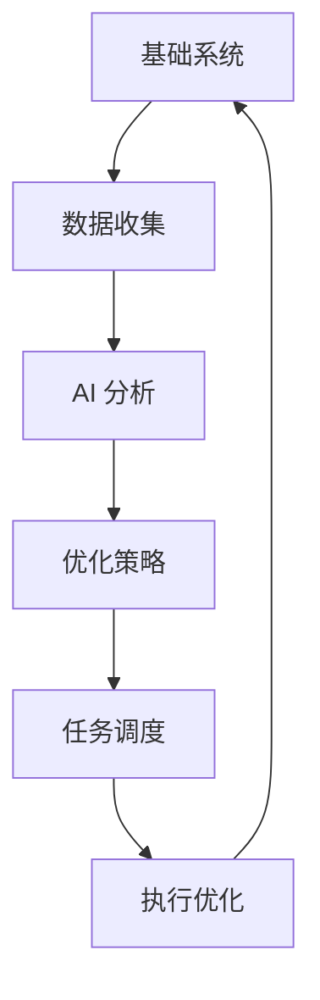
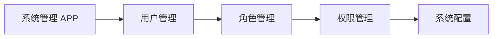

# 核心层架构

## 概述

核心层(Core)是OS_AI系统的基础架构层，提供了系统运行所需的基本功能和服务。

## 模块组成

### 1. 系统管理器 (System Manager)

位置: `Core/System/system_manager.py`

功能:
- 系统组件的集中管理
- 核心服务的初始化和配置
- 系统状态的监控和维护
- 资源的统一管理和清理

使用示例:
```python
from Core.System.system_manager import SystemManager

# 获取系统管理器实例
manager = SystemManager()

# 发布系统事件
manager.publish_event("system.status", {"status": "running"})

# 报告错误
manager.report_error("发生未知错误", ErrorType.UNKNOWN)

# 更新系统数据
manager.update_data("config.theme", "dark", persist=True)
```

### 2. 事件总线 (Event Bus)

位置: `Core/System/event_bus.py`

功能:
- 组件间的事件通信
- 事件的发布与订阅
- 优先级事件处理
- 异步事件处理

使用示例:
```python
from Core.System.event_bus import EventBus, Event, EventPriority

# 获取事件总线实例
bus = EventBus()

# 订阅事件
def handle_event(event):
    print(f"收到事件: {event.type}")
    
bus.subscribe("user.login", handle_event)

# 发布事件
event = Event("user.login", {"user_id": 123}, EventPriority.HIGH)
bus.publish(event)
```

### 3. 数据存储 (Data Store)

位置: `Core/System/data_store.py`

功能:
- 系统数据的统一管理
- 内存缓存机制
- 数据持久化
- 自动过期处理

使用示例:
```python
from Core.System.data_store import DataStore

# 获取数据存储实例
store = DataStore()

# 存储数据
store.set("user.preferences", {"theme": "dark"}, persist=True)

# 读取数据
preferences = store.get("user.preferences")

# 删除数据
store.delete("user.preferences")
```

### 4. 错误处理器 (Error Handler)

位置: `Core/System/error_handler.py`

功能:
- 统一的错误处理机制
- 错误日志记录
- 错误恢复策略
- 错误历史追踪

使用示例:
```python
from Core.System.error_handler import ErrorHandler, ErrorType, ErrorLevel

# 获取错误处理器实例
handler = ErrorHandler()

# 注册错误处理函数
def handle_system_error(error):
    print(f"处理系统错误: {error.message}")
    
handler.register_handler(ErrorType.SYSTEM, handle_system_error)

# 处理错误
handler.handle_error(
    ErrorType.SYSTEM,
    ErrorLevel.ERROR,
    "系统配置加载失败"
)
```

## 核心功能

1. 系统初始化
```python
# 系统启动流程
manager = SystemManager()
manager.init_core_services()
manager.start_system_monitor()
```

2. 事件处理
```python
# 事件处理流程
def process_event(event):
    if event.type == "system.error":
        handle_system_error(event.data)
    elif event.type == "data.update":
        handle_data_update(event.data)
```

3. 数据管理
```python
# 数据管理流程
def save_user_data(user_id, data):
    store = DataStore()
    key = f"user.{user_id}.data"
    store.set(key, data, persist=True)
```

4. 错误处理
```python
# 错误处理流程
def handle_error(error):
    handler = ErrorHandler()
    handler.handle_error(
        error.type,
        error.level,
        error.message,
        error.exception
    )
```

## 注意事项

1. 性能考虑
- 使用单例模式避免重复实例化
- 实现缓存机制提高访问速度
- 异步处理耗时操作

2. 安全考虑
- 实现访问控制机制
- 数据加密存储
- 错误信息脱敏

3. 可靠性考虑
- 实现故障恢复机制
- 定期数据备份
- 系统状态监控

## 最佳实践

1. 事件处理
- 合理使用事件优先级
- 避免事件循环依赖
- 处理超时机制

2. 数据存储
- 定期清理过期数据
- 实现数据版本控制
- 备份重要数据

3. 错误处理
- 详细记录错误信息
- 实现错误重试机制
- 提供用户友好提示

## OS_AI 核心架构文档

### 1. 架构概述

#### 1.1 系统层次结构
```
OS_AI/
├── Core/           # 核心层
│   ├── base_system.py     # 基础系统功能
│   ├── task_scheduler.py  # 任务调度系统
│   └── ai_system.py      # AI 分析系统
├── Tools/          # 工具层
│   ├── system_tools.py    # 系统工具集
│   └── system_optimizer.py # 系统优化器
└── Interface/      # 界面层
    └── optimization_ui.py  # 优化界面
```

#### 1.2 核心设计理念
- **模块化设计**: 高内聚低耦合的组件架构
- **可扩展性**: 插件化系统设计
- **轻量级**: 最小化系统开销
- **智能化**: AI 驱动的决策系统
- **安全性**: 多层次安全保护机制

### 2. 核心组件详解

#### 2.1 基础系统 (base_system.py)

#### 功能职责
- 系统资源监控
- 性能指标收集
- 系统健康检查
- 基础配置管理

#### 关键类和接口
```python
class BaseSystem:
    def monitor_resources(self)
    def collect_metrics(self)
    def check_health(self)
    def manage_config(self)
```

#### 2.2 任务调度器 (task_scheduler.py)

#### 功能职责
- 任务优先级管理
- 动态调度策略
- 资源分配优化
- 错误恢复机制

#### 关键类和接口
```python
class TaskScheduler:
    def schedule_task(self)
    def manage_priority(self)
    def optimize_resources(self)
    def handle_errors(self)
```

#### 2.3 AI 系统 (ai_system.py)

#### 功能职责
- 性能数据分析
- 行为模式识别
- 优化策略生成
- 预测性维护

#### 关键类和接口
```python
class AISystem:
    def analyze_performance(self)
    def recognize_patterns(self)
    def generate_strategy(self)
    def predict_maintenance(self)
```

### 3. 系统工具集

#### 3.1 系统工具 (system_tools.py)

#### 功能职责
- 系统清理维护
- 磁盘空间管理
- 临时文件处理
- 系统日志管理

#### 关键类和接口
```python
class SystemTools:
    def clean_system(self)
    def manage_disk_space(self)
    def handle_temp_files(self)
    def manage_logs(self)
```

#### 3.2 系统优化器 (system_optimizer.py)

#### 功能职责
- 性能优化
- 服务管理
- 启动项优化
- 网络优化

#### 关键类和接口
```python
class SystemOptimizer:
    def optimize_performance(self)
    def manage_services(self)
    def optimize_startup(self)
    def optimize_network(self)
```

### 4. 数据流架构

#### 4.1 核心数据流


#### 4.2 数据处理流程
1. 数据采集层
2. 数据预处理层
3. 分析处理层
4. 决策生成层
5. 执行反馈层

### 5. 通信机制

#### 5.1 组件间通信
- 事件驱动模型
- 消息队列系统
- 观察者模式
- 发布订阅模式

#### 5.2 通信接口
```python
class CommunicationInterface:
    def send_message(self)
    def receive_message(self)
    def register_handler(self)
    def unregister_handler(self)
```

### 6. 安全架构

#### 6.1 安全层次
- 系统级安全
- 数据安全
- 通信安全
- 访问控制

#### 6.2 安全措施
- 权限管理
- 数据加密
- 安全审计
- 入侵检测

### 7. 错误处理

#### 7.1 错误类型
- 系统错误
- 运行时错误
- 逻辑错误
- 资源错误

#### 7.2 处理机制
- 错误检测
- 错误恢复
- 错误报告
- 错误预防

### 8. 性能优化

#### 8.1 优化策略
- 资源使用优化
- 响应时间优化
- 内存管理优化
- IO 操作优化

#### 8.2 监控指标
- CPU 使用率
- 内存占用
- 磁盘 IO
- 网络延迟

### 9. 扩展机制

#### 9.1 插件系统
- 插件加载机制
- 插件生命周期
- 插件依赖管理
- 插件配置管理

#### 9.2 API 接口
```python
class PluginInterface:
    def load_plugin(self)
    def unload_plugin(self)
    def configure_plugin(self)
    def get_plugin_info(self)
```

### 10. 开发指南

#### 10.1 代码规范
- PEP 8 编码规范
- 文档字符串规范
- 命名约定
- 注释规范

#### 10.2 测试规范
- 单元测试
- 集成测试
- 性能测试
- 压力测试

### 11. 部署架构

#### 11.1 部署模式
- 单机部署
- 分布式部署
- 容器化部署
- 云端部署

#### 11.2 部署要求
- 硬件要求
- 软件依赖
- 网络要求
- 安全要求

### 12. 维护与支持

#### 12.1 维护计划
- 定期更新
- 性能优化
- 安全补丁
- 功能升级

#### 12.2 支持服务
- 技术支持
- 问题追踪
- 文档更新
- 用户培训

### 13. 未来规划

#### 13.1 短期目标
- 性能优化
- 功能完善
- 稳定性提升
- 用户体验改进

#### 13.2 长期目标
- AI 能力增强
- 架构升级
- 生态系统建设
- 国际化支持

### 14. 系统管理 APP 相关架构信息

#### 14.1 系统管理 APP 架构


#### 14.2 系统管理 APP 功能
- 用户管理
- 角色管理
- 权限管理
- 系统配置

#### 14.3 系统管理 APP 接口
```python
class SystemManagementAPP:
    def manage_users(self)
    def manage_roles(self)
    def manage_permissions(self)
    def configure_system(self)
```
